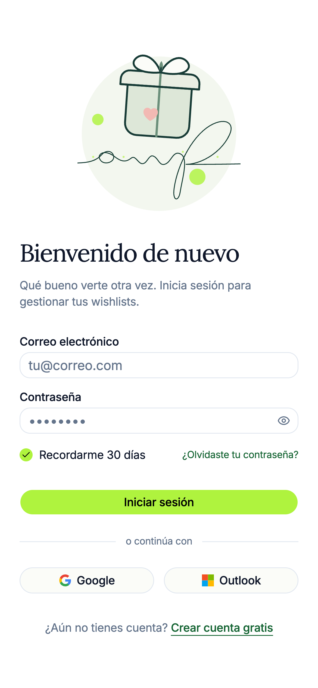
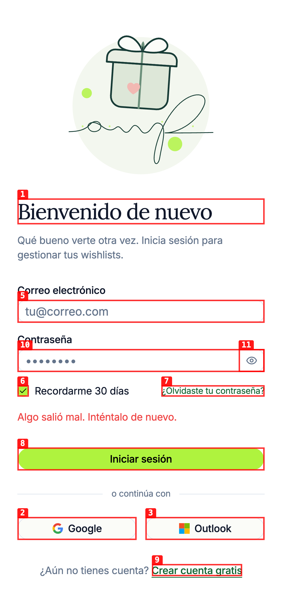
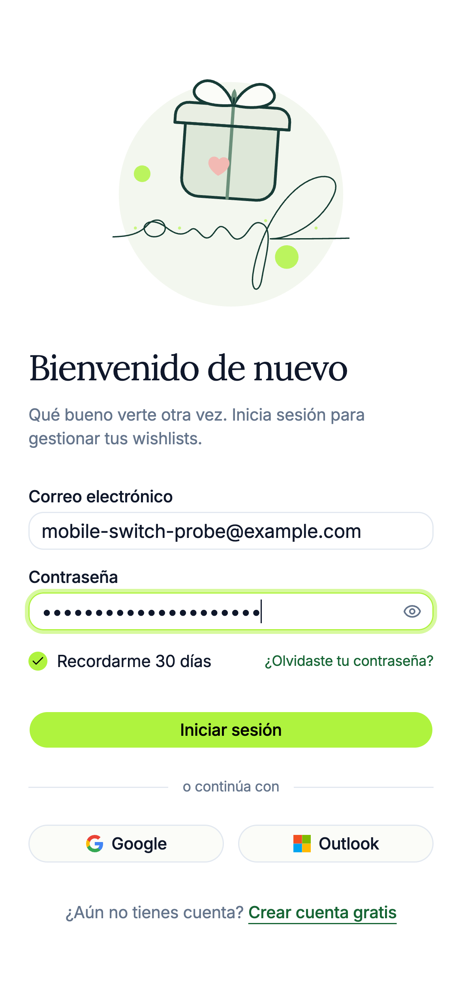
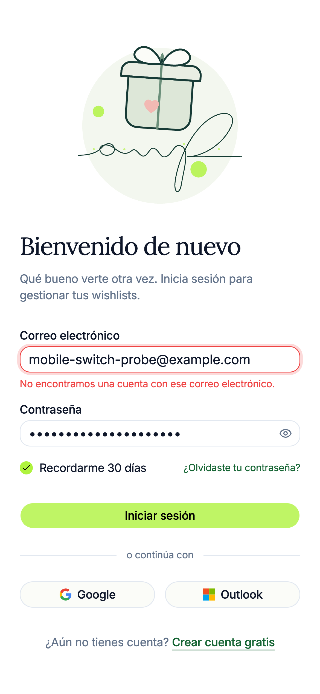
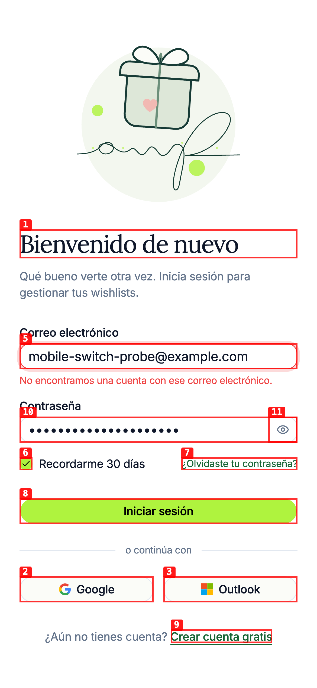

# Dogfood Report: A Wish For mobile sign-in

| Field | Value |
|-------|-------|
| **Date** | 2026-09-07 |
| **App URL** | https://awishfor.com/sign-in |
| **Session** | awishfor-mobile-signin |
| **Scope** | Mobile sign-in flows (password, Google, Outlook), auth redirects, and browser/network errors |

## Summary

| Severity | Count |
|----------|-------|
| Critical | 0 |
| High | 0 |
| Medium | 2 |
| Low | 0 |
| **Total** | **2** |

## Issues

### ISSUE-001: Outlook sign-in is offered but rejected by production Clerk

| Field | Value |
|-------|-------|
| **Severity** | medium |
| **Category** | functional / ux |
| **URL** | https://www.awishfor.com/sign-in |
| **Repro Video** | videos/issue-001-config-repro.webm |

**Description**

At an iPhone 12 viewport and iPhone Safari user agent, pressing **Outlook** does not reach Microsoft. Production Clerk rejects `oauth_microsoft` with HTTP 422 and the page only shows the generic message “Algo salió mal. Inténtalo de nuevo.” Google sign-in from the same page creates a valid Clerk sign-in attempt and reaches Google Accounts.

**Repro Steps**

1. Open the production sign-in page under iPhone 12 emulation.
   

2. Press **Outlook**.

3. **Observe:** the page remains on sign-in and shows a generic error instead of reaching Microsoft.
   

**Technical Evidence**

- A desktop-size control test receives the same rejection, so viewport/touch layout is not the root cause.
- Clerk receives `strategy=oauth_microsoft` and responds with HTTP 422.
- The response is `form_param_value_invalid`: `oauth_microsoft does not match one of the allowed values for parameter strategy`.
- The production UI calls the same unavailable strategy from both sign-in and sign-up.
- The provider-specific error is reduced to a generic failure message.

**Root Cause**

The configured Clerk instances do not currently allow the Microsoft OAuth strategy, but the application renders the Outlook action unconditionally. A clean first-action test against the local development instance at port 4005 also returned HTTP 422. The custom flow does not present Clerk's provider-availability failure clearly.

**Recommended Resolution**

Either configure and enable the Microsoft social connection for sign-up/sign-in in the production Clerk instance with production Microsoft credentials, or remove/feature-gate Outlook in the UI until the connection is ready. Add an automated test asserting that an SSO method error is rendered instead of failing silently.

### ISSUE-002: Social sign-in stops responding after a rejected password attempt

| Field | Value |
|-------|-------|
| **Severity** | medium |
| **Category** | functional / ux |
| **URL** | https://www.awishfor.com/sign-in |
| **Repro Video** | videos/issue-002-repro.webm |

**Description**

After Clerk rejects an email/password attempt, pressing **Google** or **Outlook** no longer starts an SSO request. The social button briefly runs its handler but the URL, UI, and network log remain unchanged. This can make a user who mistypes a password and then chooses social sign-in believe that sign-in is completely broken.

**Repro Steps**

1. Open the production sign-in page under iPhone 12 emulation.
   

2. Enter credentials for a nonexistent account.
   

3. Submit and observe Clerk's “No encontramos una cuenta…” error.
   

4. Press **Google**.

5. **Observe:** no Google redirect, no new Clerk request, and no new user-facing error.
   

The same no-request behavior reproduced with Outlook and on the local instance at port 4005 after a rejected password attempt.

**Root Cause**

The page reuses Clerk's current `SignInFuture` attempt when switching from password to SSO. The custom flow never calls `signIn.reset()` before starting the new strategy, so `signIn.sso()` does not start a fresh SSO attempt.

**Recommended Resolution**

Reset the current sign-in attempt before switching authentication strategies, then initiate SSO and handle the returned error/status. Add regression tests covering password failure → Google and password failure → Outlook transitions.

## Coverage and Limitations

- Confirmed on production: the sign-in page renders correctly at 390×844 with an iPhone Safari user agent.
- Confirmed on production: Google creates a Clerk sign-in attempt and reaches Google Accounts successfully.
- Confirmed on production: password submission reaches Clerk and renders the expected error for a nonexistent account.
- Confirmed at both mobile and desktop sizes: Outlook does not produce a usable redirect; the desktop control exposed Clerk's exact HTTP 422 response.
- Confirmed on production mobile: after a rejected password attempt, both social strategies stop before issuing a network request.
- Confirmed on the local app at port 4005: a clean Outlook attempt is also rejected by the development Clerk instance with HTTP 422.
- Not verified: the post-authentication password redirect with valid credentials. The available encrypted local test credential is stale, and no production account was created or modified.

## Follow-up Risk (not reproduced)

The password success path calls `signIn.finalize()` and then performs `router.push()`, whereas the OAuth callback passes a `navigate` callback to `finalize()` and deliberately hard-navigates to avoid racing Clerk's session cookie. Current Clerk custom-flow guidance places destination navigation inside `finalize({ navigate })`. Aligning the password path would reduce a plausible mobile timing risk, but there is not enough reproduction evidence to classify it as a second issue yet.
