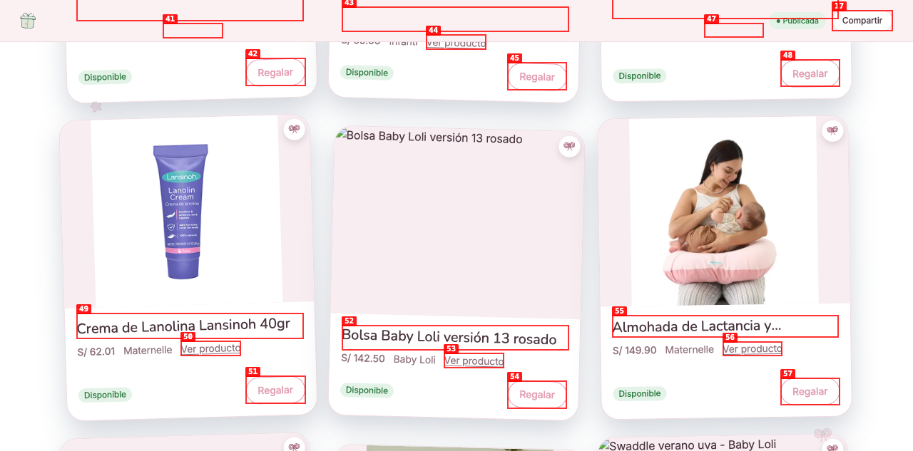
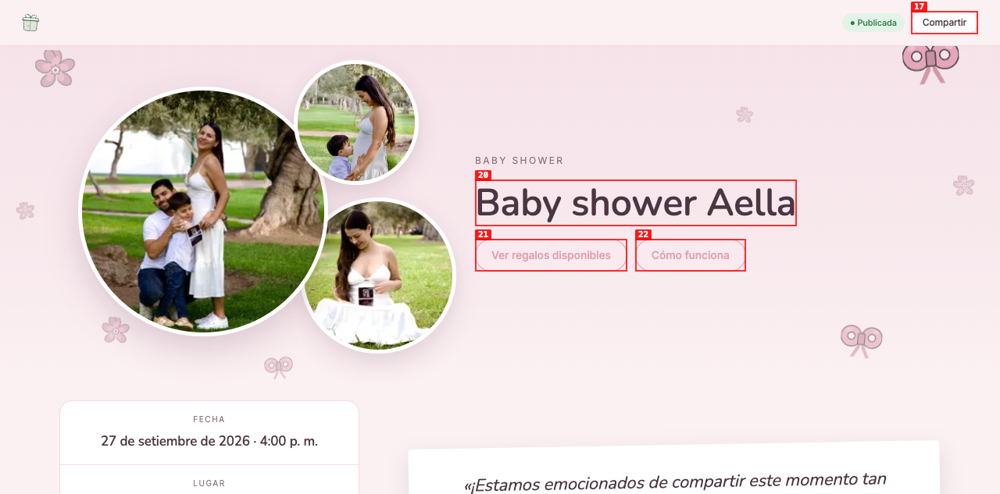
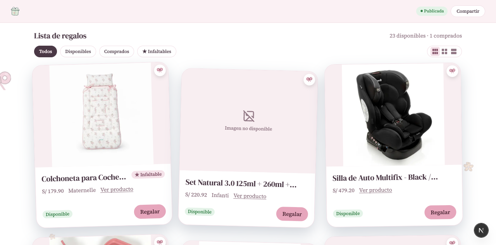

# Dogfood Report: A Wish For public wishlist

| Field | Value |
|---|---|
| **Date** | 2026-08-18 |
| **App URL** | https://www.awishfor.com/w/baby-shower-aella |
| **Session** | awishfor-review-eb985174e9b5 |
| **Scope** | Missing gift images and reported console error |

## Summary

| Severity | Count |
|---|---:|
| Critical | 0 |
| High | 0 |
| Medium | 2 |
| Low | 0 |
| **Total** | **2** |

## Issues

### ISSUE-001: Two Baby Loli product images fail to render

| Field | Value |
|---|---|
| **Severity** | medium |
| **Category** | visual / console |
| **URL** | https://www.awishfor.com/w/baby-shower-aella |
| **Repro Video** | N/A — visible after scrolling the gift list |

**Description**

The cards “Bolsa Baby Loli versión 13 rosado” and “Swaddle verano uva - Baby Loli” show a broken-image icon and alt text. Their Next.js image optimizer requests return HTTP 502 because the upstream `babyloli.pe` image host returns HTTP 403 to server-side fetches.

**Repro Steps**

1. Navigate to the public wishlist and scroll to the gift list.
2. Scroll to the Baby Loli cards.
3. Observe the two broken image regions.

### ISSUE-002: Countdown hydration text differs between server and browser

| Field | Value |
|---|---|
| **Severity** | medium |
| **Category** | console / functional |
| **URL** | https://www.awishfor.com/w/baby-shower-aella |
| **Repro Video** | N/A — occurs on initial page hydration |

**Description**

The production console records React error #418 with the `text` argument. The server-rendered HTML says “Faltan 40 días,” while the hydrated browser says “Faltan 39 días.” The event date is serialized as UTC midnight and was being shifted to the previous calendar day in the America/Lima timezone.

**Repro Steps**

1. Navigate to the public wishlist in the America/Lima timezone.
2. Compare the countdown in the server HTML with the hydrated DOM.
3. Observe `Faltan 40 días` on the server, `Faltan 39 días` in the client, and React error #418 in the console.

## Fix verification

- Serialized UTC-midnight event dates now retain their calendar date on the client; the local server and browser both rendered the same countdown with no page errors.
- A forced gift-image failure now renders an accessible “Imagen no disponible” fallback instead of the browser's broken-image UI.

